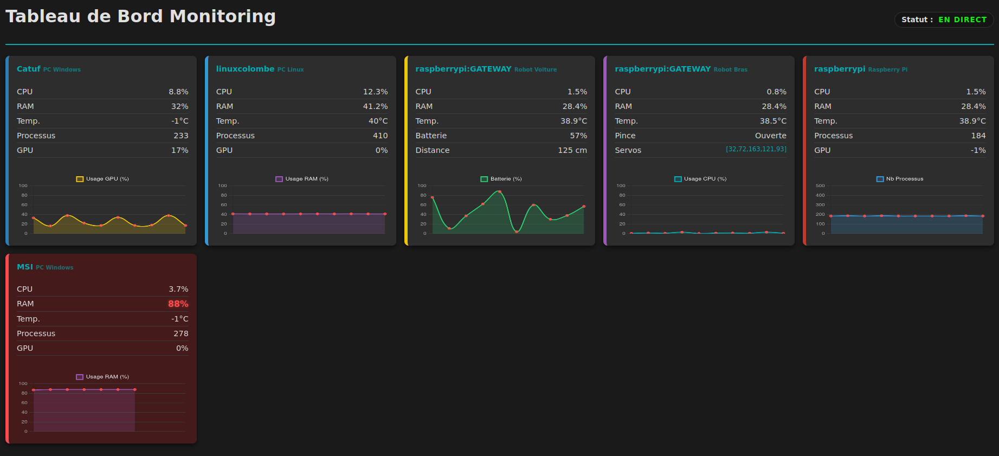

# � Real-Time IoT Monitoring System


A full-stack C monitoring solution designed to collect, transmit, and visualize real-time data from a heterogeneous hardware fleet (Linux PCs, Windows machines, Raspberry Pi, and Arduino robots).



## � Key Features

* **Multi-Architecture Support:** Seamless communication between x86 (PC) and ARM (Raspberry Pi) architectures.
* **Custom TCP Protocol:** Optimized binary protocol for efficient data transmission.
* **High Concurrency:** Server handles multiple clients simultaneously using I/O Multiplexing (`poll`) and Multithreading (`pthreads`).
* **Hardware Integration:** Direct serial communication (UART) with Arduino robots via a custom Gateway.
* **Real-Time Web Dashboard:** Embedded HTTP server (written in C) serving a dynamic JS dashboard.

## �️ Architecture

The system is built on a Client/Server model:

1.  **The Server (Hub):** Hosted on Linux. Aggregates data and serves the Web Interface.
    * *Tech:* Sockets, Mutex, Threads, Poll.
2.  **The Clients (Probes):**
    * **Desktop Client:** Collects CPU/RAM/GPU usage (Linux/Windows).
    * **Gateway Client (RPi):** Connects to Arduino robots via USB/Serial to fetch battery levels and sensor data.

## � Project Structure

```text
├── src/            # Source code (Server, Clients, Utils)
├── include/        # Header files
├── web/            # Frontend (HTML, CSS, JS)
├── Makefile        # Compilation instructions
└── README.md       # Documentation
```
## � How to Build

### Prerequisites
* GCC Compiler
* Make
* Pthread library (usually installed by default on Linux)

### Compilation Steps

1.  **Build the entire project (Linux parts only):**
    ```bash
    make all
    ```

2.  **Build specific components:**
    ```bash
    make serveur       # Builds the central server
    make client_linux # Builds the desktop probe
    make client_gateway      # Builds the RPi gateway
    make client_windows # Builds the Windows desktop probe
    ```

## �️ Usage

### 1. Start the Server
The server will start listening on port 8080 (for probes) and 8081 (for the web interface).
```bash
./bin/serveur
```

### 2. Start a Client (Probe)
To start a monitoring client on a Linux machine:
```bash
./bin/client_linux -s <SERVER_IP>:<PORT>
# Example: ./bin/client_linux -s 127.0.0.1:8080
```
To start the Gateway on a Raspberry Pi (with Arduino connected):
```bash
./bin/gateway -s <SERVER_IP>:<PORT> -t <ROBOT_TYPE>
# Type 1: Car Robot / Type 2: Arm Robot
```

### 3. Access the Dashboard
Open your web browser and navigate to:
http://localhost:8081


## � License
Distributed under the MIT License. See LICENSE for more information.